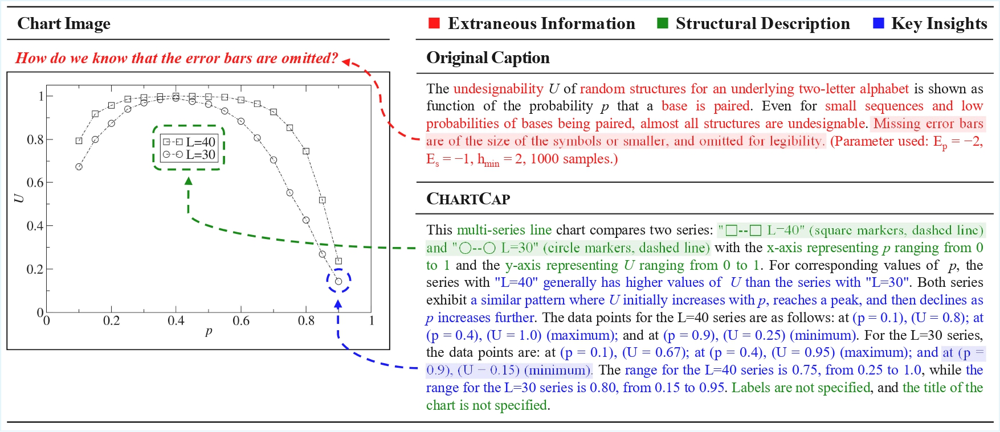

<div align="center">

## ChartCap: Mitigating Hallucination of Dense Chart Captioning

[**Junyoung Lim**](https://vision.snu.ac.kr/people/junyoung.html)&nbsp;&nbsp;&nbsp;&nbsp;
[**Jaewoo Ahn**](https://ahnjaewoo.github.io/)&nbsp;&nbsp;&nbsp;&nbsp;
[**Gunhee Kim**](https://vision.snu.ac.kr/gunhee/)&nbsp;&nbsp;&nbsp;&nbsp;<br />
Seoul National University<br />
**ICCV 2025 (<span style="color:#F44336">Highlight</span>)**

<a href="https://junyoung-00.github.io/ChartCap/"></a> &ensp;
<a href="https://arxiv.org/abs/2508.03164"></a> &ensp;
<a href="https://huggingface.co/datasets/junyoung-00/ChartCap"></a> &ensp;
<a href="https://huggingface.co/junyoung-00/Phi-3.5-vision-instruct-ChartCap"></a> &ensp;

</div>



## Abstract

Generating accurate, informative, and hallucination-free captions for charts remains challenging for vision language models, primarily due to the lack of large-scale, high-quality datasets of real-world charts. However, existing real-world chart datasets suffer from the inclusion of extraneous information that cannot be inferred from the chart and failure to sufficiently capture structural elements and key insights. Therefore, we introduce ChartCap, a large-scale dataset of 565K real-world chart images paired with type-specific, dense captions that exclude extraneous information and highlight both structural elements and key insights in detail. To build ChartCap, we design a four-stage pipeline that generates captions using only the discernible data from the chart and employ a cycle consistency-based human verification, which accelerates quality control without sacrificing accuracy. Additionally, we propose a novel metric, the Visual Consistency Score, which evaluates caption quality by measuring the similarity between the chart regenerated from a caption and the original chart, independent of reference captions. Extensive experiments confirm that models fine-tuned on ChartCap consistently generate more accurate and informative captions with reduced hallucinations, surpassing both open-source and proprietary models and even human-annotated captions.

## 1.  Inference Demo

```bash
conda create -n phi python=3.10 -y
conda activate phi
pip install -r Phi3.5-vision-instruct-ChartCap/requirements.txt
pip install flash-attn==2.5.8 --no-cache-dir --no-build-isolation

# captions example.png with base and fine-tuned checkpoints
python -m Phi3.5-vision-instruct-ChartCap
````

| Checkpoint ID                                  | Console alias                  |
| ---------------------------------------------- | ------------------------------ |
| `microsoft/Phi-3.5-vision-instruct`            | **Phi3.5-Vision-4B**           |
| `junyoung-00/Phi-3.5-vision-instruct-ChartCap` | **Phi3.5-Vision-4B\_ChartCap** |

Both models have **never** seen *example.png*; the run is strictly zero-shot.

---

## 2.  Visual Consistency Score & OCRScore

### 2.1. Environment

```bash
conda create -n vcs python=3.10 -y
conda activate vcs
pip install -r visual_consistency_score/requirements.txt
pip install flash-attn==2.5.8 --no-cache-dir --no-build-isolation
pip install paddlepaddle-gpu==3.0.0 -i https://www.paddlepaddle.org.cn/packages/stable/cu118/
pip install paddleocr==2.9.1
```

### 2.2. Input Format

`data/captions.json` must be a list of objects with **both** keys:

```jsonc
[
  {
    "image_filename": "chart_0001.png",
    "generated_caption": "A bar chart showing …"
  },
  ...
]
```

### 2.3. Run

```bash
export ANTHROPIC_API_KEY="your-api-key"

python visual_consistency_score/evaluate.py \
       --input_json  data/captions.json \
       --image_dir   data/images \
       --output_json results.json
```

*What the script does*

1. **Caption → Matplotlib code** via **Claude-3.5 Sonnet**
2. **Chart Regeneration** (up to three debug attempts)
3. **VCS** using SIGLIP-2 cosine similarity
4. **OCRScore** using PaddleOCR

### 2.4 Typical Console Output

```
=== Metrics Summary ===
Total items:                 1234
Successful reconstructions:  1234 (100.00%)
Average VCS Score:           0.1234 (±0.0254)
Average OCR F1 Score:        0.1234 (±0.2041)
```

`results.json` stores per-image scores and dataset-level aggregates.

## License

The use of the released code, dataset, and model must strictly adhere to the respective licenses. Our code and model is released under the [MIT license](./LICENSE), and our dataset is released under the [Creative Commons Attribution 4.0 International License](https://choosealicense.com/licenses/cc-by-4.0/). 

## Citation

```bibtex
@inproceedings{lim2025chartcap,
  title     = {ChartCap: Mitigating Hallucination of Dense Chart Captioning},
  author    = {Junyoung Lim and Jaewoo Ahn and Gunhee Kim},
  booktitle = {ICCV},
  year      = {2025},
}
```